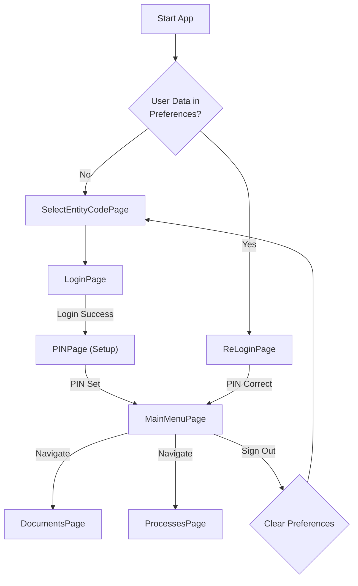
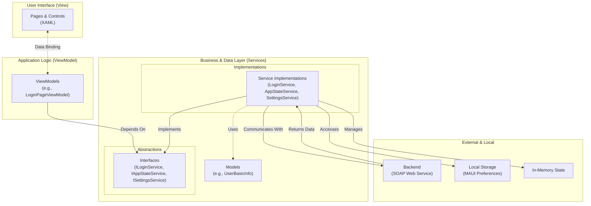

# Table of Contents
- [WebDocMobile Project Overview](#webdocmobile-project-overview)
  - [High-Level Functionality](#high-level-functionality)
  - [Application Diagrams](#application-diagrams)
  - [Core Functionality & User Flow](#core-functionality--user-flow)
  - [Project Architecture and Key Components](#project-architecture-and-key-components)
  - [Technical Details](#technical-details)
  - [Major Code Changes](#major-code-changes)
- [Project Breakdown: The Services Folder](#project-breakdown-the-services-folder)
  - [Service-by-Service Breakdown](#service-by-service-breakdown)
- [Project Breakdown: Pages and PageModels (The View & ViewModel)](#project-breakdown-pages-and-pagemodels-the-view--viewmodel)
  - [The User's Journey: A Page-by-Page Explanation](#the-users-journey-a-page-by-page-explanation)
- [Project Breakdown: The Models Folder](#project-breakdown-the-models-folder)
  - [1. Data Transfer Objects (DTOs)](#1-data-transfer-objects-dtos)
  - [2. Application / Domain Models](#2-application--domain-models)
  - [3. UI-Specific Models](#3-ui-specific-models)
  - [4. Web Service Contract Models](#4-web-service-contract-models)
- [Explaining the Model Interaction Diagram](#explaining-the-model-interaction-diagram)
  - [The Flow: From Login to Dashboard](#the-flow-from-login-to-dashboard)
  - [Summary](#summary)
- [Project Breakdown: UI Customization](#project-breakdown-ui-customization)
  - [1. `CustomControls` Folder](#1-customcontrols-folder)
  - 2. `Handlers`
  - 3. `Converters`


# WebDocMobile Project Overview

`WebDocMobile` is a cross-platform application built with .NET MAUI. Its primary purpose is to serve as a mobile and desktop client for a document and process management system, likely called "WebDoc".

---

## High-Level Functionality

The application allows users to:
1.  Connect to a specific organization's backend by providing an "Entity Code".
2.  Log in with their existing desktop credentials.
3.  Set up a local PIN for quick and secure re-entry into the app.
4.  View summaries and statistics of their documents and processes.
5.  Navigate to dedicated sections for managing documents and processes.

The project is structured to provide a different user interface for mobile (Android/iOS) versus desktop (Windows/macOS), although the core business logic in the ViewModels is shared.

---

## Application Diagrams

### User Flow Diagram

This diagram illustrates the navigation paths a user can take within the application.



### Architecture Diagram

This diagram shows the **new, improved architecture** of the project after refactoring. It highlights how components are now decoupled through service abstractions.



---

## Core Functionality & User Flow

The application has a clear, logical flow for the user.

1.  **First-Time Launch (Onboarding)**:
    - The app checks for saved user data. If none is found, it directs the user to the `SelectEntityCodePage`.
    - The user enters an "Entity Code" (e.g., `1994` or `1995`). This code identifies their organization and configures the correct backend server address.
    - This configuration (`baseAddress` and `codigoEntidade`) is saved locally using `.NET MAUI`'s `Preferences` API.
    - The user is then taken to the `LoginPage`.

2.  **Authentication**:
    - On the `LoginPage`, the user enters their username and password.
    - The `LoginPageViewModel` communicates with an `InitService` to get a session token (`hashCode`) and then uses a `LoginService` to authenticate the user.
    - Upon successful login, the app fetches initial lists of documents and stores them in global static variables within the `App` class.
    - The user's basic information (including the session `hashCode`) is saved to `Preferences`.
    - The user is then navigated to the `PINPage` to set up a security PIN.

3.  **Security Setup (PIN)**:
    - The `PINPage` requires the user to create a 6-digit PIN for securing the app locally.
    - The PIN is stored as part of the user's saved data in `Preferences`.
    - After setting the PIN, the user is taken to the `MainMenuPage`.

4.  **Main Application Usage**:
    - The `MainMenuPage` acts as the central dashboard. It greets the user and displays key metrics using data fetched after login. It features a Telerik pie chart for data visualization.
    - From here, the user can navigate to the `DocumentsPage` or `ProcessesPage`.
    - The user can also sign out, which clears their data from `Preferences`.

5.  **Subsequent Launches (Re-Login)**:
    - When the user re-opens the app, the `App` class detects the saved `Preferences`.
    - It skips the entity code and login pages, navigating directly to the `ReLoginPage`.
    - The user enters their previously configured PIN to unlock the app and proceeds to the `MainMenuPage`.

---

## Project Architecture and Key Components

The project follows the **Model-View-ViewModel (MVVM)** design pattern.

### Key Files and Their Roles

*   **`MauiProgram.cs`**: The application's entry point. It configures and bootstraps the app, with its most critical role being the setup of the **Dependency Injection (DI)** container. All services, pages, and ViewModels are registered here.

*   **`App.xaml.cs`**: The application's main class, now with a minimal role. It receives the fully-configured `AppShell` from the DI container and sets it as the `MainPage`. It no longer contains any state management or navigation logic.

*   **`AppShell.xaml.cs`**: The application's main navigation host. It registers all page routes and, crucially, contains the **initial startup logic** in its `OnAppearing` method. It uses the injected `ISettingsService` to determine the user's starting page.

*   **`Services/`**: This new directory contains the core business logic, decoupled from the UI.
    *   **`IAppStateService.cs`**: Manages volatile, in-memory state for the current session (e.g., the logged-in user's details, lists of documents).
    *   **`ISettingsService.cs`**: Manages data that persists between sessions (e.g., saved user info, server address). It abstracts away the specific storage mechanism.

*   **`Helpers/WsMethods.cs`**: This large file contains C# classes decorated with `System.Xml.Serialization` attributes. This strongly suggests they were generated from a **SOAP WSDL**, meaning the application communicates with an XML-based web service.

*   **`CustomControls/OutlinedControlEntry.xaml`**: A reusable component that combines a `Frame`, `Label`, and `Entry` to create a modern text input field with a floating placeholder animation.

### Data Flow and Persistence

*   **Persistence**: The app uses the **`ISettingsService`** to save and retrieve data that needs to persist between sessions. This service currently uses `.NET MAUI`'s `Preferences` API as its backend, but this is an implementation detail that is completely hidden from the rest of the application. This abstraction makes the system more maintainable and testable.

*   **State Management**: Volatile runtime state (data that only exists while the app is running, like fetched document lists) is managed by the **`IAppStateService`** singleton. ViewModels receive this service via DI to access or modify the application's current state in a decoupled and testable way, completely replacing the old `App.staticProperty` pattern.

---

## Technical Details

*   **Framework:** .NET MAUI
*   **Architecture:** MVVM (Model-View-ViewModel)
*   **UI Libraries:**
    *   Telerik UI for .NET MAUI
    *   .NET MAUI Community Toolkit
*   **Backend Communication:** SOAP Web Services (inferred from `WsMethods.cs`)
*   **Local Storage:** `.NET MAUI` `Preferences` API

---

## Major Code Changes

This section documents significant architectural and code-level improvements made to the application over time.


### 1. Refactoring Global State Management

*   **Change**: The initial implementation stored volatile runtime data (e.g., `UserDetails`, `allDocuments`) in `public static` properties within the `App.xaml.cs` file. This has been refactored into a dedicated singleton service, `IAppStateService`, registered via dependency injection.

*   **Reasoning**:
    *   **Decoupling**: Using static properties on the `App` class creates a tight coupling between ViewModels and the `App` class, making the code harder to test and maintain.
    *   **Testability**: ViewModels that depended on `App.staticProperty` were difficult to unit test. By injecting an `IAppStateService`, we can now provide a mock implementation of the service during testing, allowing for isolated and reliable tests of our ViewModel logic.
    *   **Scalability**: As the application grows, managing state through a dedicated service is more scalable and organized than adding more static properties to the `App` class. The service provides a single, clear API for state access and modification.

#### Practical Example:

**Before:** The ViewModel directly accessed static properties on the `App` class.
```csharp
// In LoginPageViewModel.cs

public async Task HandleLogIn()
{
    // ... login logic ...
    App.UserDetails = userDetails; // Direct static access
    App.allDocuments = await _documentService.ListDocuments(...); // Direct static access
}
```

**After:** The ViewModel receives the `IAppStateService` via its constructor and uses it to manage state.
```csharp
// In LoginPageViewModel.cs

private readonly IAppStateService _appStateService;
public LoginPageViewModel(IAppStateService appStateService, ...) { ... }

public async Task HandleLogIn()
{
    // ... login logic ...
    _appStateService.UserDetails = userDetails; // Access via injected service
    _appStateService.AllDocuments = await _documentService.ListDocuments(...); // Access via injected service
}
```

### 2. Abstracting Local Storage Access

*   **Change**: All direct calls to the `Microsoft.Maui.Storage.Preferences` API have been removed from ViewModels and other classes. This logic is now encapsulated within a new singleton service, `ISettingsService`.
    *   **Flexibility & Maintainability**: If we need to switch from `Preferences` to a more secure option like `SecureStorage` or a local database, we only need to update the `SettingsService.cs` implementation. No other code in the application needs to change.
    *   **Robustness**: By centralizing the storage logic, we can add features like serialization error handling in a single location, making the entire application more resilient to data corruption.

#### Practical Example:

**Before:** The ViewModel directly called the `Preferences` API.
```csharp
// In SelectEntityCodePageViewModel.cs

private async Task ValidateEntityCode()
{
    // ... validation logic ...
    Preferences.Set("baseAddress", address); // Direct API call
    Preferences.Set("codigoEntidade", CodigoEntidade); // Direct API call
}
```

**After:** The ViewModel uses the injected `ISettingsService` to save data, unaware of the underlying storage mechanism.
```csharp
// In SelectEntityCodePageViewModel.cs

private readonly ISettingsService _settingsService;
public SelectEntityCodePageViewModel(ISettingsService settingsService, ...) { ... }

private async Task ValidateEntityCode()
{
    // ... validation logic ...
    _settingsService.BaseAddress = address; // Set property on the service
    _settingsService.CodigoEntidade = CodigoEntidade; // Set property on the service
}
```

### 3. Consistent Dependency Injection (DI) for Pages and ViewModels

*   **Change**: Pages no longer create their own ViewModels using `new MyViewModel()`. Instead, both Pages and ViewModels are registered as `Transient` services in `MauiProgram.cs`. Pages now receive their corresponding ViewModel via constructor injection.
    *   **Correctness**: Manually creating ViewModels bypasses the DI container, which means none of their own dependencies (like `IAlertService` or `IAppStateService`) would be injected, leading to runtime crashes.
    *   **Loose Coupling**: The View (Page) is no longer responsible for constructing its ViewModel. This separation is a core principle of MVVM and DI, making the components more independent and reusable.

#### Practical Example:

**Before:** The Page's code-behind was responsible for creating the ViewModel instance.
```csharp
// In ReLoginPageMobile.xaml.cs

public ReLoginPageMobile()
{
    InitializeComponent();
    // Manual instantiation couples the View to the ViewModel's constructor.
    this.BindingContext = new ReLoginPageViewModel(new AlertService(), ...);
}
```

**After:** The DI container provides the fully-formed ViewModel to the Page's constructor.
```csharp
// In ReLoginPageMobile.xaml.cs

public ReLoginPageMobile(ReLoginPageViewModel viewModel) // ViewModel is injected here
{
    InitializeComponent();
    this.BindingContext = viewModel; // The View is no longer responsible for creation.
}
```

### 4. Centralized and Robust Startup Navigation

*   **Change**: The initial navigation logic (checking `Preferences` and deciding whether to show the `ReLoginPage` or `SelectEntityCodePage`) was moved from the `App.xaml.cs` constructor to the `AppShell.xaml.cs` `OnAppearing` method.
    *   **Lifecycle Safety**: The `OnAppearing` event of the `Shell` fires when the UI is fully initialized and ready for navigation. Performing navigation in the `App` constructor can lead to race conditions or errors where navigation is attempted before the visual tree is ready.
    *   **Clarity and Responsibility**: The `AppShell` is the natural place to manage the application's root navigation flow. This change makes the `App.xaml.cs` cleaner and focused on application-level concerns, while `AppShell.xaml.cs` handles the navigation structure.

#### Practical Example:

**Before:** Navigation logic was placed directly in the `App.xaml.cs` constructor, which can be unsafe.
```csharp
// In App.xaml.cs

public App()
{
    InitializeComponent();
    MainPage = new AppShell();

    // This logic runs before the UI might be fully ready.
    if (Preferences.ContainsKey("UserDetails"))
    {
        // This type of navigation from the App constructor is discouraged.
        MainPage.Navigation.PushAsync(new ReLoginPageMobile(...));
    }
}
```

**After:** The logic is moved to `AppShell.xaml.cs`, which now uses the `ISettingsService` for a cleaner check.
```csharp
// In AppShell.xaml.cs

private readonly ISettingsService _settingsService;
public AppShell(ISettingsService settingsService) { ... }

protected override async void OnAppearing()
{
    base.OnAppearing();
    // This logic runs at a safe point in the app's lifecycle.
    if (_settingsService.UserInfo != null)
    {
        await Shell.Current.GoToAsync($"//{nameof(ReLoginPageMobile)}");
    }
    else
    {
        await Shell.Current.GoToAsync($"//{nameof(SelectEntityCodePageMobile)}");
    }
}
```

### 5. ViewModel-Driven UI State

*   **Change**: Complex UI logic has been moved out of the View's code-behind (`.xaml.cs`) and into the corresponding ViewModel. The View now uses simple data binding to reflect the state managed by the ViewModel. This was implemented on the PIN entry screens (`PINPageMobile` and `ReLoginPageMobile`).

*   **Reasoning**:
    *   **True MVVM Adherence**: The View's responsibility is to display data and forward user actions (like button clicks) to the ViewModel. It should not contain logic for how to manage its own state. This change enforces a strict separation of concerns.
    *   **Testability**: It is now possible to write unit tests for the UI logic. For example, we can test the `ReLoginPageViewModel` to verify that calling the `AddDigitCommand` correctly updates the `PinDigits` collection, without ever needing to run the UI itself.
    *   **Maintainability**: The XAML becomes cleaner and more declarative, describing *what* to show, not *how* to show it. All the complex "how" logic is centralized in the ViewModel, making it easier to find, debug, and modify.

#### Practical Example:

**Before:** The code-behind file contained a large, error-prone `switch` statement to manually control the visibility of UI elements.
```csharp
// In ReLoginPageMobile.xaml.cs (Old Code)

private void SetPINCircles()
{
    switch (currentDigit)
    {
        case 0:
            SelectedCircle1.IsVisible = false;
            SelectionCircle1.IsVisible = true;
            // ... and so on for all 6 circles ...
            break;
        // ... other cases ...
    }
}
```

**After:** The ViewModel manages a simple collection, and the XAML uses a `BindableLayout` to render it. The code-behind is now empty of this logic.
```csharp
// In ReLoginPageViewModel.cs
private void UpdatePinCircles()
{
    for (int i = 0; i < PinDigits.Count; i++)
    {
        PinDigits[i].IsFilled = i < Pin.Length;
    }
}
```
```xml
<!-- In ReLoginPageMobile.xaml -->
<HorizontalStack
<!-- In ReLoginPageMobile.xaml -->
<HorizontalStackLayout BindableLayout.ItemsSource="{Binding PinDigits}">
    <BindableLayout.ItemTemplate>
        <DataTemplate>
            <Ellipse Fill="{Binding IsFilled, Converter={StaticResource BoolToColorConverter}}"/>
        </DataTemplate>
    </BindableLayout.ItemTemplate>
</HorizontalStackLayout>
```

# Project Breakdown: The Services Folder

The `Services` folder is the engine room of the WebDocMobile application. Its primary role is to handle logic that is not directly related to the user interface (UI). This separation of concerns is a fundamental principle of modern app development and the MVVM (Model-View-ViewModel) pattern.

By placing logic in services, we achieve several key benefits:
- **Decoupling**: The UI (Views) and UI logic (ViewModels) don't need to know *how* data is fetched or saved. They just ask a service to do it.
- **Reusability**: The same service can be used by multiple ViewModels. For example, both the `LoginPageViewModel` and `ReLoginPageViewModel` need to fetch documents, so they both use the `IDocumentService`.
- **Testability**: It's much easier to write automated tests for services than for UI code. We can test a service in isolation to ensure its logic is correct.
- **Maintainability**: When the backend API changes, we only need to update the relevant service, not every page that uses that API.

All services are registered in `MauiProgram.cs` using Dependency Injection. This means we can simply "ask for" a service in a ViewModel's constructor, and the system will provide the correct instance.

---

## Service-by-Service Breakdown

Let's look at each service interface and its implementation.

### 1. State Management Services

These services are responsible for managing data and state within the app.

#### `ISettingsService` / `SettingsService`

*   **Purpose**: To save and retrieve data that needs to **persist** between application sessions. If the user closes the app and reopens it, this data will still be there.
*   **How it works**: It acts as a wrapper around the .NET MAUI `Preferences` API, which saves simple key-value data to the device's native settings storage. For complex objects like `UserBasicInfo`, it serializes them to a JSON string before saving.
*   **Key Usage**:
    *   `SelectEntityCodePageViewModel` saves the server `BaseAddress` and `CodigoEntidade`.
    *   `AppShell` reads `UserInfo` on startup to decide whether to show the `ReLoginPageMobile` or the `SelectEntityCodePageMobile`.
    *   `PINPageViewModel` saves the user's PIN to their `UserInfo`.

*   **Example Flow**:
    1.  User enters an entity code in `SelectEntityCodePageMobile`.
    2.  `SelectEntityCodePageViewModel` calls `_settingsService.BaseAddress = "..."`.
    3.  The `SettingsService` saves this address to the device's storage.
    4.  Later, when an API service needs to make a call, it can retrieve this address from the `SettingsService`.

#### `IAppStateService` / `AppStateService`

*   **Purpose**: To hold **temporary, in-memory** state for the current application session. This data is lost when the app is closed.
*   **How it works**: It's a simple C# class that holds public properties. Because it's registered as a `Singleton` in `MauiProgram.cs`, every part of the app gets the exact same instance, so they share the same data.
*   **Key Usage**:
    *   After a successful login, `LoginPageViewModel` fetches all the document lists and stores them in the `IAppStateService`.
    *   `MainMenuPageViewModel` then reads these lists from the `IAppStateService` to display the counts and the chart. This avoids having to re-fetch all the data from the server when navigating to the main menu.

*   **Diagram: State Management Flow**
    ```
    +-----------------------------+     Saves/Reads     +------------------------+
    |      ViewModels             |-------------------->|   ISettingsService     | (Persistent Storage)
    | (e.g., LoginPageViewModel)  |                     | (UserInfo, BaseAddress)|
    +-----------------------------+     Saves/Reads     +------------------------+
              |                   |-------------------->|   IAppStateService     | (In-Memory State)
              |                                         | (Document Lists, etc.) |
              +-----------------------------------------+------------------------+
    ```

### 2. API Communication Services

These services are responsible for all communication with the backend web server. They abstract away the complexities of making HTTP requests.

*   `IInitService`: Gets the initial `hashCode` required for a session.
*   `ILoginService`: Handles user authentication.
*   `IDocumentService`: Fetches and manages documents.
*   `IProcessService`: Fetches and manages processes.
*   `IWorkflowService`: Handles workflow actions like forwarding documents.

*   **Purpose**: To provide a clean, strongly-typed way for the ViewModels to interact with the backend API without needing to know about `HttpClient`, JSON serialization, or API endpoints.
*   **Key Usage**: The `HandleLogIn` method in `LoginPageViewModel` is a perfect example. It orchestrates calls to multiple services to perform the login sequence:
    1.  Call `_initService.Init()` to get a session hash.
    2.  Call `_loginService.LoginUserBasic(...)` with the hash and credentials.
    3.  If successful, call `_documentService.ListMyDocuments(...)` to get user data.

### 3. Utility Services

#### `IAlertService` / `AlertService`

*   **Purpose**: To provide a simple, testable way to show pop-up alerts to the user.
*   **How it works**: It's a thin wrapper around MAUI's `Application.Current.MainPage.DisplayAlert()`.
*   **Why it's needed**: By using an `IAlertService` interface, we can easily create a "mock" version of the service during automated testing. This mock service wouldn't actually show a UI pop-up (which is impossible in a test environment) but could instead just verify that the `ShowAlert` method was called with the correct text. This makes our ViewModels fully testable.

# Project Breakdown: Pages and PageModels (The View & ViewModel)

In the WebDocMobile application, the `Pages` and `PageModels` folders work together to create the user experience. This structure is the heart of the **MVVM (Model-View-ViewModel)** design pattern, which separates the visual interface from the underlying logic.

*   **`Pages` (The Views):** These are the `.xaml` files that define *what* the user sees. They contain the layout, controls (buttons, labels, entries), and visual styling. The C# code-behind file (`.xaml.cs`) is kept as minimal as possible, usually just to connect the View to its ViewModel.

*   **`PageModels` (The ViewModels):** These are the `.cs` files that define *how* the View behaves. They contain the application logic, data properties that the View binds to, and commands that are executed when the user interacts with the UI. **A ViewModel never directly references a UI control.** It only exposes data and actions.

This separation is powerful:
*   **Testability**: We can write automated tests for the ViewModel logic without needing to run the UI.
*   **Maintainability**: We can change the UI (the View) without breaking the business logic (the ViewModel), and vice-versa.
*   **Clarity**: The role of each file is clear and distinct.

### The User's Journey: A Page-by-Page Explanation

Let's trace the flow of the application from first launch to the main menu.

#### 1. App Startup & Initial Routing

The journey doesn't start with a Page, but with `AppShell.xaml.cs`. This is the control center for navigation.

*   **`AppShell.xaml.cs`**: When the app starts, the `OnAppearing` method is called.
    1.  It asks the `ISettingsService` if there is any saved `UserInfo`.
    2.  **If `UserInfo` exists**: The user has logged in before. The app navigates directly to the `ReLoginPageMobile`.
    3.  **If `UserInfo` is `null`**: This is a first-time user (or they signed out). The app navigates to the `SelectEntityCodePageMobile`.

#### 2. `SelectEntityCodePage`

This is the first screen a new user sees.

*   **View (`SelectEntityCodePageMobile.xaml`):**
    *   Defines the UI with a title, a description, an `OutlinedControlEntry` for the entity code, and several buttons.
    *   It has visual states for "Loading" and "Incorrect Code" that are controlled by `bool` properties in the ViewModel (`IsLoading`, `IsWrongCode`).

*   **ViewModel (`SelectEntityCodePageViewModel.cs`):**
    *   Holds the `CodigoEntidade` property, which is bound to the `Text` of the entry field.
    *   The `ValidateEntityCodeCommand` is executed when the "Validate" button is tapped.
    *   **Logic**:
        1.  Sets `IsLoading = true` to show the loading indicator.
        2.  Checks if the `CodigoEntidade` is valid ("1994" or "1995").
        3.  If valid, it uses the `_settingsService` to save the correct server `BaseAddress` and the `CodigoEntidade`. This data will now persist even if the app closes.
        4.  It navigates to the login page using `Shell.Current.GoToAsync($"//{nameof(LoginPageMobile)}?codEntidade={CodigoEntidade}")`.
            *   The `//` prefix clears the navigation history so the user can't go back to this page.
            *   The `?codEntidade=...` part passes the entity code to the next page as a parameter.
        4.  If invalid, it sets `IsWrongCode = true` to show the error message UI.

#### 3. `LoginPage`

The user enters their credentials here.

*   **View (`LoginPageMobile.xaml`):**
    *   A simple UI with two `OutlinedControlEntry` controls for username and password, and a login button.
    *   The `Text` properties of the entries are bound to `strUserName` and `strPassword` in the ViewModel.
    *   The login button's `Command` is bound to the `HandleLogInCommand`.

*   **ViewModel (`LoginPageViewModel.cs`):**
    *   It uses the `[QueryProperty]` attribute to automatically receive the `codEntidade` passed during navigation and set its `CodigoEntidade` property.
    *   The `HandleLogInCommand` is the core of the login process:
        1.  Calls `_initService.Init()` to get a session `hashCode`.
        2.  Calls `_loginService.LoginUserBasic(...)` with the credentials.
        3.  If successful:
            *   Creates a `UserBasicInfo` object with all the user's session details.
            *   Saves this object to `_settingsService.UserInfo` (for long-term persistence) and `_appStateService.UserDetails` (for the current session).
            *   Calls the `GetDocuments()` method to pre-fetch all document lists from the server and store them in the `_appStateService`. **This is a key performance optimization.**
            *   Navigates to the `PINPageMobile` to have the user set up a PIN.

#### 4. `PINPage` & `ReLoginPage`

These two pages are visually and functionally very similar. `PINPage` is for *setting* the PIN the first time, and `ReLoginPage` is for *entering* it on subsequent app launches.

*   **View (`PINPageMobile.xaml` & `ReLoginPageMobile.xaml`):**
    *   A custom UI with a number pad made of `Button`s.
    *   A `HorizontalStackLayout` uses `BindableLayout.ItemsSource="{Binding PinDigits}"` to dynamically create the six indicator circles.
    *   Each circle's color and opacity are bound to the `IsFilled` property of a `PinDigitViewModel` object, using `BoolToColorConverter` and `BoolToOpacityConverter`.

*   **ViewModel (`PINPageViewModel.cs` & `ReLoginPageViewModel.cs`):**
    *   Contains a `PinDigits` collection of `PinDigitViewModel`s to control the UI circles.
    *   The `AddDigitCommand` and `DeleteDigitCommand` modify the `Pin` string property.
    *   Whenever the `Pin` string changes, the `UpdatePinCircles()` method is called to update the `IsFilled` status of the `PinDigitViewModel` objects, which in turn updates the UI.
    *   **Logic on 6th digit:**
        *   **`PINPageViewModel`**: It saves the completed PIN into the `_settingsService.UserInfo` object and navigates to the `MainMenuPageMobile`.
        *   **`ReLoginPageViewModel`**: It compares the entered PIN with the one stored in `_settingsService.UserInfo.PIN`. If they match, it calls `GetDocuments()` to refresh the data and navigates to the `MainMenuPageMobile`. If not, it shows an error and clears the PIN.

#### 5. `MainMenuPage`

This is the central hub of the application after logging in.

*   **View (`MainMenuPageMobile.xaml`):**
    *   A complex dashboard layout.
    *   Labels are bound to properties like `MyDocumentsNumber`, `DepartmentDocumentsNumber`, etc., to show the counts.
    *   A `<telerik:RadPieChart>` is bound to the `ChartData` collection in the ViewModel to display the data visually.
    *   Buttons for "Documents" and "Processes" are bound to a `ToggleChartCommand` to switch the chart's data source.

*   **ViewModel (`MainMenuPageViewModel.cs`):**
    *   **Crucially, it does NOT make any new API calls when it loads.**
    *   In its constructor, it simply reads the document lists that were already fetched and stored in the `_appStateService` by the `LoginPageViewModel` or `ReLoginPageViewModel`. This makes the main menu appear instantly.
    *   It populates the count properties (`MyDocumentsNumber`, etc.) and the `Documents` collection for the chart from this state.
    *   The `HandleSignOutButtonCommand` clears all data from both `_settingsService` and `_appStateService` and navigates the user back to the `SelectEntityCodePageMobile`, starting the flow over.

# Project Breakdown: The Models Folder

The `Models` folder contains the data blueprints for the entire application. In a well-structured app, we can find several different kinds of models, each with a specific purpose. This separation helps keep the code clean, organized, and easy to understand.

Let's break down the types of models in this project.

---

### 1. Data Transfer Objects (DTOs)

**Location**: `Models/DocumentService`, `Models/LoginService`, `Models/InitService`, etc.

*   **Purpose**: DTOs are simple classes whose only job is to define the exact shape of data being sent to or received from a specific API endpoint. They act as a clear "contract" between the mobile app and the web server.
*   **Why use them?**: They ensure that you only send the data the server needs and only receive the data the app expects. This makes your API calls efficient and predictable.
*   **Example**: `Models/LoginService/LoginUserBasicDto.cs`
    *   This class contains exactly four properties: `strHashCode`, `strUserName`, `strPassword`, and `strDomainName`.
    *   When the `LoginPageViewModel` calls the `_loginService.LoginUserBasic(...)` method, it passes these four pieces of data. The service implementation will then package them into a `LoginUserBasicDto` object to send to the server.

*   **Code Improvement Suggestion**:
    *   The file `listALLDocumentDto.cs` uses a lowercase class name, which goes against standard C# naming conventions (`PascalCase` for class names). Renaming the file and class to `ListAllDocumentsDto` would improve consistency and readability.

### 2. Application / Domain Models

**Location**: `Models/` (root)

*   **Purpose**: These models represent the core business objects of your application. They hold data that is used across different screens and services.
*   **Example**: `Models/UserBasicInfo.cs`
    *   This is a perfect example of an application model. It's not tied to any single API call or UI element.
    *   It holds the essential information about the logged-in user: their session hash, name, domain, and PIN.
    *   The `ISettingsService` serializes this object to JSON to save it to the device's persistent storage.
    *   The `IAppStateService` holds an instance of this object in memory for quick access during the current session.
    *   Multiple ViewModels (`ReLoginPageViewModel`, `MainMenuPageViewModel`) access this data from the services.

### 3. UI-Specific Models

**Location**: `Models/` or sometimes within `PageModels/`

*   **Purpose**: These are small, specialized models created to support a specific piece of the user interface.
*   **Example 1**: `Models/CategoricalData.cs`
    *   This model is designed purely for the Telerik Pie Chart on the `MainMenuPageMobile`. The chart component requires a data source where each item has a `Category` (a string like "Comigo") and a `Value` (a number like 5). This model provides that exact structure.
*   **Example 2**: `PageModels/PagesViewModels/PinDigitViewModel.cs`
    *   While this lives in the `PageModels` folder and inherits from `ObservableObject`, it functions as a UI-specific model. Its sole purpose is to represent the state (filled or not filled) of one of the six PIN indicator circles on the `PINPageMobile` and `ReLoginPageMobile`. The `PINPageViewModel` holds a collection of these to easily control the UI.

### 4. Web Service Contract Models

**Location**: `Helpers/WsMethods.cs`

*   **Purpose**: This large file contains classes like `GDDocument`, `GDProcess`, `WorkFlowState`, etc. These are not DTOs in the same way as the others. They appear to be **auto-generated classes** from a web service definition (likely a WSDL for a SOAP service, given the style and `System.Xml.Serialization` attributes).
*   **Role**: These classes represent the complex, raw data structures exactly as the backend server defines them. They are often large and can contain nested objects.
*   **How they are used**:
    1.  A ViewModel (e.g., `LoginPageViewModel`) initiates an action.
    2.  It calls a service method, like `_documentService.ListMyDocuments(...)`.
    3.  The `DocumentService` makes the actual API call.
    4.  The server responds with data that gets deserialized into these contract models (e.g., a `List<GDDocument>`).
    5.  The service returns this list to the ViewModel, which then uses the data to populate its properties.

*   **Diagram: Model Interaction Flow**
    ```
    +-------------------+   Uses   +-------------------+   Creates/Sends   +-----------------+
    |   ViewModel       |--------->|      Service      |------------------>|       DTO       |
    | (e.g., LoginPage) |          | (e.g., LoginSvc)  |                   | (LoginUserBasic)|
    +-------------------+          +-------------------+                   +-----------------+
            ^                                |
            |                                | Receives
            |                                V
    +-------------------+          +-------------------+
    |   UI-Specific     |   <------|   Web Service     |
    |   Model           |  Populated   Contract Model  |
    | (CategoricalData) |   from     (e.g., GDDocument)|
    +-------------------+          +-------------------+
    ```

    # Explaining the Model Interaction Diagram

The diagram shows the journey of data through the application, from the user's screen to the server and back again. Each type of "Model" has a very specific job at a different stage of this journey.

Let's trace the data flow for the login process.

---

### The Flow: From Login to Dashboard

#### **Step 1: The ViewModel Gathers User Input**

*   **Where:** `LoginPageViewModel.cs`
*   **What happens:** The user types their username and password into the `OutlinedControlEntry` controls on the `LoginPageMobile`.
*   **Data:** These text values are bound to the `strUserName` and `strPassword` properties in the `LoginPageViewModel`. At this point, the data is just simple C# strings.

#### **Step 2: The ViewModel Asks a Service to Do Something**

*   **Where:** `LoginPageViewModel.cs` -> `HandleLogIn()` method.
*   **What happens:** The ViewModel calls the `_loginService.LoginUserBasic(...)` method, passing the `strUserName` and `strPassword` strings as arguments. The ViewModel doesn't know or care *how* the login happens; it just delegates the task.

#### **Step 3: The Service Creates a DTO to Send Data**

*   **Where:** Inside the `LoginService` implementation (not visible, but this is how it works).
*   **What happens:** The `LoginService`'s job is to talk to the server. It takes the simple strings it received and packages them into a **Data Transfer Object (DTO)**.
*   **Model Used:** `LoginUserBasicDto.cs`
    *   This DTO is a "package" specifically designed for the login API endpoint. It has properties for `strHashCode`, `strUserName`, `strPassword`, and `strDomainName`.
    *   The service creates an instance of this DTO and fills it with the data. It then converts this object into JSON to send to the server.

*   **This is this part of the diagram:**
    ```
    +-------------------+   Creates/Sends   +-----------------+
    |      Service      |------------------>|       DTO       |
    | (e.g., LoginSvc)  |                   | (LoginUserBasic)|
    +-------------------+                   +-----------------+
    ```

#### **Step 4: The Service Receives Data from the Server**

*   **Where:** `LoginPageViewModel.cs` -> `GetDocuments()` method.
*   **What happens:** After a successful login, the ViewModel calls `_documentService.ListMyDocuments(...)`. The `DocumentService` makes an API call, and the server sends back a list of documents. This data is complex, with many fields and nested objects.
*   **Model Used:** `GDDocument` (from `Helpers/WsMethods.cs`)
    *   This is a **Web Service Contract Model**. Its structure is an exact match for the complex data the server sends.
    *   The `DocumentService` receives the raw JSON from the server and deserializes it into a `List<GDDocument>`.

*   **This is this part of the diagram:**
    ```
    +-------------------+   Receives   +--------------------+
    |      Service      | <------------|   Web Service      |
    | (e.g., DocSvc)    |              |   Contract Model   |
    +-------------------+              | (e.g., GDDocument) |
                                       +--------------------+
    ```

#### **Step 5: The ViewModel Transforms Data for the UI**

*   **Where:** `MainMenuPageViewModel.cs`
*   **What happens:** The user is now on the main menu. The `MainMenuPageViewModel` needs to display the document counts in the Telerik Pie Chart. The Pie Chart doesn't know what a `GDDocument` is. It needs a simple list of items with a `Category` and a `Value`.
*   **Model Used:** `CategoricalData.cs`
    *   This is a **UI-Specific Model**. It's designed for one purpose: to feed data to the chart.
    *   The ViewModel takes the `List<GDDocument>` (which it got from the `IAppStateService`), counts the different types, and creates a new `ObservableCollection<CategoricalData>`.
    *   It populates it like this: `new CategoricalData { Category = "Comigo", Value = 5 }`.

*   **This is this part of the diagram:**
    ```
    +-------------------+   Populated from   +-------------------+
    |   ViewModel       | -----------------> |   UI-Specific     |
    | (e.g., MainMenu)  |                    |   Model           |
    +-------------------+                    | (CategoricalData) |
                                             +-------------------+
    ```

### Summary

*   **DTOs (`LoginUserBasicDto`)**: Simple "packages" used to **send** data to the server in a clean, predictable format.
*   **Web Service Contract Models (`GDDocument`)**: Complex classes used to **receive** the raw, detailed data from the server.
*   **UI-Specific Models (`CategoricalData`)**: Simple classes used to **transform** the server data into a shape that a specific UI control (like a chart) can easily understand.

This clear separation of model types is a hallmark of a well-architected application. It makes the flow of data easy to trace and ensures that each part of the app is only concerned with the data it needs.

---

# Project Breakdown: UI Customization

This section covers the folders that are all about creating a unique and reusable look and feel for the application: `CustomControls`, `Handlers`, and `Converters`.

---

### 1. `CustomControls` Folder

*   **Purpose**: To create new, reusable UI components by combining existing ones. This is a powerful way to avoid duplicating complex XAML code across multiple pages and ensures your UI remains consistent.
*   **File**: `OutlinedControlEntry.xaml` / `.cs`

#### In-Depth: The `OutlinedControlEntry`

This is a fantastic example of a custom control. It's not just a simple `Entry`; it's a self-contained component that provides a modern user experience.

*   **What it is**: It's a custom-built text input field that implements the "Material Design" style, where the placeholder text acts as a floating label. When the user focuses on the entry or types text into it, the placeholder animates up and out of the way.

*   **How it's built (The View - `.xaml`)**:
    *   It's a `Grid` that cleverly overlays three elements:
        1.  A `Frame` that provides the rounded blue border.
        2.  A `BorderlessEntry` (which we'll cover next) that is the actual, invisible text input field.
        3.  A `Label` (`lblPlaceholder`) that sits on top and displays the placeholder text.
    *   The `VisualStateManager` is the key to the animation. It defines two states:
        *   **`Normal`**: The placeholder label is large, gray, and sits in the middle.
        *   **`Focused`**: The placeholder label shrinks, becomes blue, and moves up (`TranslationY="-25"`).

*   **How it works (The Logic - `.xaml.cs`)**:
    *   **`BindableProperty`**: It defines `TextProperty` and `PlaceholderProperty`. This is what makes it a true, reusable control. It allows you to bind a ViewModel property to the control's `Text` in your pages, just like a standard `Entry`. The `TwoWay` binding on `Text` is essential for this to work correctly.
    *   **`UpdateVisualState()`**: This is the control's brain. It's called whenever the entry is focused, unfocused, or the text changes. It contains one simple but crucial line:
        ```csharp
        string state = txtEntry.IsFocused || !string.IsNullOrEmpty(Text) ? "Focused" : "Normal";
        ```
        This logic means the placeholder will "float" (the `Focused` state) if the user is currently typing in the box **OR** if the box already contains text, even if it's not focused. This is the correct and expected behavior for this type of modern control.
    *   **`TapGestureRecognizer`**: This makes the whole control tappable. If the user taps on the placeholder `Label`, the `txtEntry` inside gets the focus.

### 2. `Handlers` Folder

*   **Purpose**: Handlers are a powerful .NET MAUI feature for deep, platform-specific customization. They let you access the native underlying control (e.g., `EditText` on Android, `UITextField` on iOS) and change its properties directly.
*   **File**: `BorderlessEntry.cs`
    *   This class is very simple; it just inherits from `Entry`. It acts as a "marker" class.
    *   The real magic happens in `MauiProgram.cs`:
        ```csharp
        Microsoft.Maui.Handlers.EntryHandler.Mapper.AppendToMapping(nameof(Entry), (handler, view) =>
        {
        #if ANDROID
            handler.PlatformView.SetBackgroundColor(Android.Graphics.Color.Transparent);
        #endif
        });
        ```
        This code snippet tells the app: "For every `Entry` control on Android, find its native platform view and make its background transparent." This removes the default underline that Android puts on text fields, allowing our custom `Frame` in `OutlinedControlEntry` to provide the border instead.

### 3. `Converters` Folder

*   **Purpose**: Converters are data-binding translators. They sit between the ViewModel (the data source) and the View (the UI target) and convert values from one type to another. They are essential when a ViewModel property (like a `bool`) doesn't directly match the UI property you want to control (like a `Color`).
*   **Files**: `BoolToColorConverter.cs` & `BoolToOpacityConverter.cs`
    *   **Where they are used**: On the `PINPageMobile` and `ReLoginPageMobile` to control the appearance of the six PIN indicator circles.
    *   **How they work**:
        *   The UI is bound to a collection of `PinDigitViewModel`s, and each one has an `IsFilled` boolean property.
        *   **`BoolToColorConverter`**: The `Ellipse.Fill` property is bound to `IsFilled` through this converter. If `IsFilled` is `true`, it returns blue; otherwise, it returns white.
        *   **`BoolToOpacityConverter`**: The `Ellipse.Opacity` property is also bound to `IsFilled`. If `IsFilled` is `true`, it returns `1.0` (fully visible); otherwise, it returns `0.15` (mostly transparent).
    *   This combination allows a single `bool` property in the ViewModel to control two different visual aspects of the UI in a very clean and declarative way, without cluttering the ViewModel with UI-specific logic.

---


